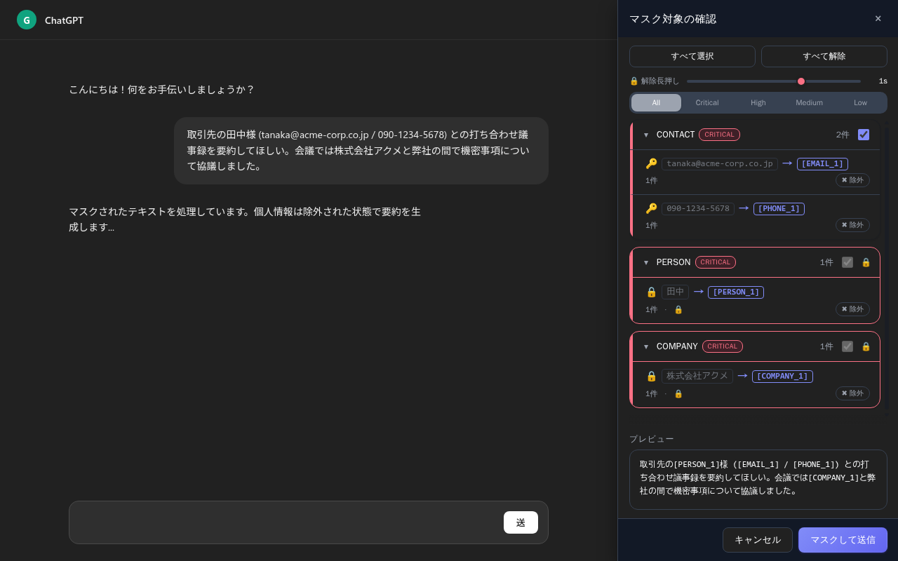

# PII Guard

**日本語** | [English](README.en.md)

生成 AI のチャットに文章を送る前に、その中の個人情報や社外に出したくない数字を見つけて、伏せ字に置き換える Chrome 拡張機能です。

標準の状態では、判定はすべてブラウザの中で行います。入力した内容を開発者や第三者のサーバーに送ることはありません。

**[Chrome ウェブストアからインストール](https://chromewebstore.google.com/detail/pii-guard/bkgalenjdoegfmomajjngbegpjmokejm)**



## 対応しているサービス

| サービス | 動作する URL |
|---|---|
| ChatGPT | `https://chatgpt.com/*`、`https://*.openai.com/*` |
| Claude | `https://claude.ai/*`、`https://*.claude.com/*` |
| Gemini | `https://gemini.google.com/*` |
| Manus | `https://*.manus.im/*` |

これ以外のサイトでは動きません。動作を確かめているブラウザは Google Chrome です。

## 使い方

1. Chrome ウェブストアからインストールします。設定は要りません。
2. 対応サービスの入力欄に、いつもどおり文章を書いて送信します。
3. 画面の右側に確認用のサイドバーが開きます。伏せる項目を確かめて「選択したものをマスクして送信」を押します。

送信そのものをやめるときは「キャンセル」を押します。キーボードでは Enter で送信、Esc で中止です。

### サイドバーでできること

- 項目ごとに、伏せるか原文のまま送るかを切り替えられます。原文のまま送る項目には、右端に緑の線が付きます。
- 重要度 (Critical、High、Medium、Low) のタブで、表示する項目を絞り込めます。
- 実際に送られる文章を、下のプレビューで確かめられます。
- 項目の「✖ 除外」を押すと、その語は次から伏せなくなります。
- チャット画面の文字を選んでサイドバーにドラッグすると、その語を常に伏せる語として登録できます。登録するときに種類 (人名、会社名など) を選びます。

「機密」「未公開」「confidential」などの語を含む文では、人名・会社名・金額の項目がロックされます。ロックを外すには項目を長押しします。長押しの長さは、サイドバー上部のスライダーで変えられます。

## 見つけられる情報

| 種類 | 例 |
|---|---|
| 連絡先 | 電話番号、メールアドレス、住所、郵便番号 |
| 人名 | 日本人の姓名とフリガナ、英語圏の名前 |
| 個人を特定する番号 | マイナンバー、運転免許証番号、パスポート番号、海外の社会保障番号 |
| お金に関わる情報 | クレジットカード番号、銀行口座、国際銀行口座番号 (IBAN)、暗号資産のアドレス |
| 会社と業務の情報 | 会社名、法人番号、インボイス登録番号、社員番号、顧客番号、契約番号、発注番号、請求書番号 |
| 認証情報 | API キー (30 種類以上のトークン形式)、パスワード、秘密鍵、データベースの接続文字列、Cookie |
| 社内ネットワーク | IP アドレス、MAC アドレス、社内のホスト名 |
| その他 | 生年月日、年齢、性別、学校や保育施設の名前、端末の識別子 |

全角で書かれた番号や、大文字で書かれたパスワードの設定行にも対応しています。

### 業務上の数字

価格改定の率、見積額、予算、掛け率、割引、出資の比率も伏せ字にします。

パーセンテージは前後の文脈で判断します。値上げ、粗利、手数料といった話題の近くにあるものだけを伏せ、プログラムの設定値や公表済みの税率はそのまま残します。

### 中身が機密にあたる文

「未発表の値上げ」「進行中の買収交渉」のように、書式ではなく内容そのものが社外に出せない文を見つけると、サイドバーに注意を表示します。

- 文全体は伏せません。伏せると、相手に伝えたいことまで失われるためです。
- 同じ文の中の会社名、金額、人名などは、ふだんどおり伏せます。
- こうした文の中の率、倍率、「500万」のような金額は、話題に関係なく伏せます。
- なぜ注意を出したのか (話題や、未公表を示す言い回し) もあわせて表示します。

大きく言い換えた表現は見逃すことがあります。

## 設定

ツールバーの PII Guard のアイコンを押すとポップアップが開きます。ポップアップの「⚙ 詳細設定 / 除外リスト管理」から設定画面を開けます。

| 項目 | 場所 | 内容 |
|---|---|---|
| マスキングを有効化 | ポップアップ | 拡張機能の働きを一時的に止めます |
| 送信前に確認 | ポップアップ、設定画面 | オフにすると、サイドバーを出さずに自動で伏せて送ります |
| UI モード | ポップアップ、設定画面 | サイドバー (推奨) か、画面中央のモーダルかを選びます |
| このタブのマスク件数 | ポップアップ | 開いているタブで伏せた件数です |
| マスキング除外リスト | 設定画面 | 伏せない語の追加と削除、JSON での書き出しと読み込みができます |
| ブラウザ内 ML 検出 | 設定画面 | 次の「オプション機能」を参照してください |
| ローカル LLM 連携 | 設定画面 | 次の「オプション機能」を参照してください |

## オプション機能

どちらも初期状態では無効です。有効にするときに、ブラウザが通信の許可を求めます。許可しなければ通信は起きません。

### ブラウザ内の言語モデルで人名・地名・組織名を見つける

辞書や書式では見つからない人名・地名・組織名を、文脈から見分ける小型の言語モデルです。モデルはブラウザの中で動きます。

- 有効にすると、モデル (約 135MB) を Hugging Face から一度だけ取得します。
- 取得したモデルはブラウザに保存され、次からはオフラインで動きます。
- 取得のときに送られるのは、どのファイルを取得するかという情報だけです。入力した文章は含まれません。

### 自分で動かしている LLM と連携する

自分の PC や社内のサーバーで動かしている LLM を指定すると、文脈を踏まえた判定を足せます。Ollama、LM Studio、llama.cpp など、OpenAI 互換の API を持つものが使えます。入力した文章は、指定したサーバーだけに送られます。

Ollama を Docker で動かす場合の例です。

```bash
docker run -d --name ollama -p 127.0.0.1:11434:11434 -v ollama:/root/.ollama \
  -e OLLAMA_ORIGINS=chrome-extension://bkgalenjdoegfmomajjngbegpjmokejm \
  ollama/ollama
docker exec ollama ollama pull qwen3:4b
```

`OLLAMA_ORIGINS` は、この拡張機能から Ollama を呼べるようにする設定です。ここで許可するのは PII Guard だけです。

設定画面の「ローカル LLM 連携」で次のように設定します。

1. 「LLM 補助検出を有効化」をオンにします。
2. エンドポイント URL に `http://localhost:11434` を入れて「接続確認」を押します。
3. 使うモデルを選びます。日本語では `qwen3:4b` 以上をおすすめします。

動作モードは 2 つあります。「検出補助」は、拡張機能の判定に LLM の判定を足します。「AI 置換 (実験的)」は、LLM が文章全体を置き換えます。LLM の応答が遅いときは、タイムアウトを長くしてください。

## プライバシー

| データ | 行き先 |
|---|---|
| 入力した文章と判定の結果 | ブラウザの中だけで処理します。ローカル LLM 連携を有効にしたときだけ、指定したサーバーに送ります |
| 伏せ字にした後の文章 | 利用者が送信先に選んだ AI サービスに届きます。これは通常の送信と同じです |
| 設定、除外リスト、常に伏せる語 | ブラウザの中にだけ保存します。拡張機能を削除すると一緒に消えます |
| ブラウザ内 ML 検出のモデル | 有効にしたときに Hugging Face から取得します |

利用状況の計測や、開発者への送信はありません。詳しくは [プライバシーポリシー](browser-extension/PRIVACY.md) を参照してください。

## よくある質問

**サイドバーが開きません。**

対応サービスのページか確かめてください。インストールや更新の直後は、開いていたタブを再読み込みしてください。ポップアップで「マスキングを有効化」と「送信前に確認」がオンになっているかも確かめてください。

**伏せたくない語が毎回選ばれます。**

サイドバーでその項目の「✖ 除外」を押すか、設定画面の除外リストに登録してください。会社名やプロジェクト名、自分の名前などに向いています。

**伏せたい語が見つかりません。**

チャット画面でその語を選び、サイドバーにドラッグして登録してください。以後はいつも伏せます。人名の見逃しが多いときは、ブラウザ内 ML 検出も試してください。

**AI からの返答に含まれる個人情報も伏せますか。**

いいえ。対象はこちらから送る文章だけです。

**すべての個人情報を確実に見つけられますか。**

いいえ。見逃しも誤検出もあります。送る前にサイドバーで内容を確かめてください。

## 既知の制限

- 画像や添付ファイルの中の文字は対象外です。
- AI からの返答は対象外です。
- 苗字は、よく使われる 50 種類を辞書で見つけます。それ以外の人名は、「様」「さん」などの敬称や「氏名:」のような手がかりがあるときか、ブラウザ内 ML 検出を有効にしたときに見つけます。
- パーセンテージは、業務の話題の近くにあるときか、機密にあたる文の中にあるときにだけ伏せます。

## 不具合の報告と要望

[Issues](https://github.com/sna4i/pii-guard/issues) で受け付けています。

Issue は誰でも読めます。見逃された文章をそのまま貼らず、氏名や番号を架空のものに置き換えてから報告してください。

## 開発者向け

- [開発者向け資料](docs/development.md): ゲートウェイ、MCP サーバ、検出エンジン、テスト、ビルドの手順
- [拡張機能の開発メモ](browser-extension/README.md)
- [変更履歴](browser-extension/CHANGELOG.md)
- [push 前チェック](docs/prepush-check.md): クローンしたら最初に `git config core.hooksPath .githooks` を実行してください
